# THE TASTEY RESTAURANT WEBSITE

### Table of contents

- [Project Developer](#project-developer)
- [Brief Description](#brief-description)
- [Visual Previews](#visual-previews)
- [More Info!](#more-info)
  - [Folder Contents](#folder-contents)
  - [Built With](#built-with)
  - [Links](#quick-links)

## Project Developer

- I am Oketade Oluwatobiloba, a Fullstack Developer in training. This restaurant themed website is a supposed website for a made up restaurant called 'Tastey'. It was supposed to be a school assignment but I ventured into it alone since the teacher was no longer interested. The goal for now is to finish the project as a form of practice.

## Brief Description

This project includes html files, css files in a styles folder and js files in a scripts folder and the assets folder containing all the extra materials used in development for the web pages of a restaurant website for The Tastey Restaurant.
It is a 5 page website but connected to each other by internal links. The Reservation page is still in the development phase.
It is a personal project and I would really like to describe it as just practice as I experimented a quite Uncommon user interefaces.

### Visusal Previews

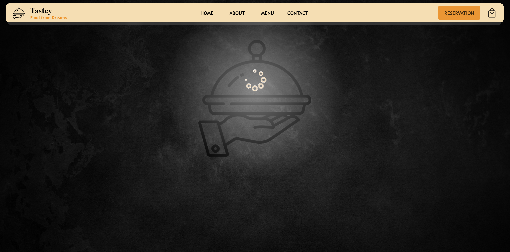
_Desktop view of the Tastey Preloader_

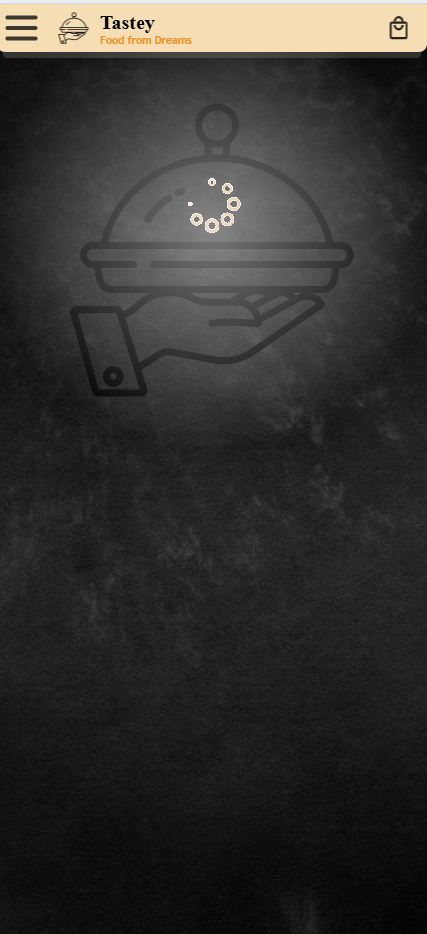
_Mobile view of the Tastey Preloader_

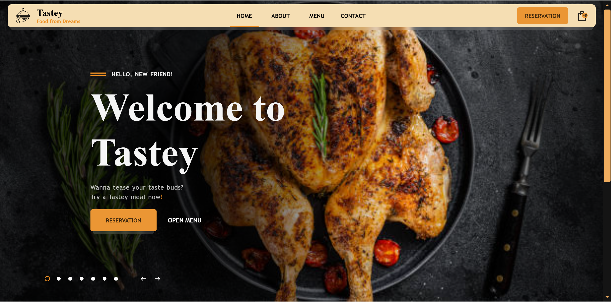
_Desktop view of the Tastey Landing Page_

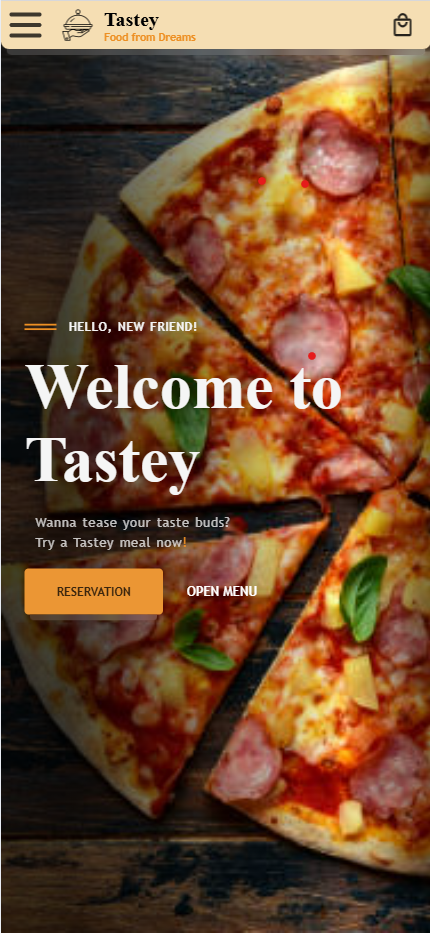
_Mobile view of the Tastey Landing Page_

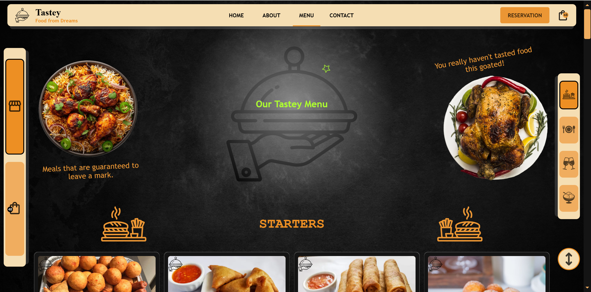
_Desktop view of the Tastey Manu_

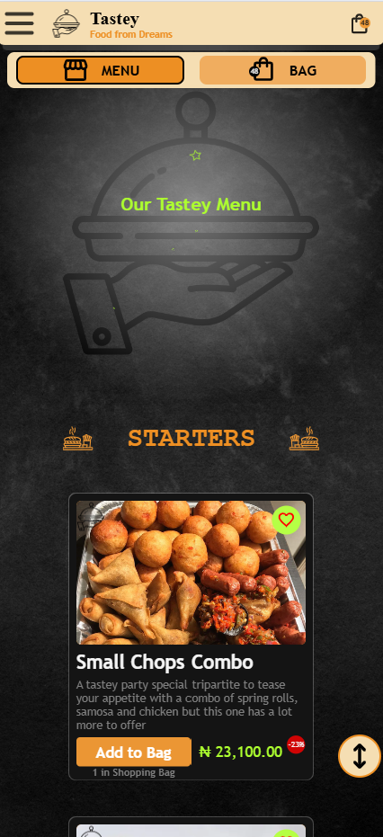
_Mobile view of the Tastey Menu_

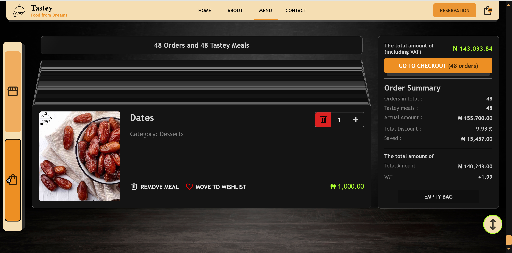
_Desktop view of the Tastey Shopping Bag_

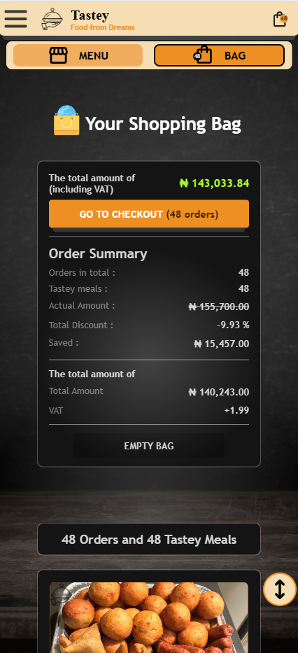
_Mobile view of the Tastey Shopping Bag_

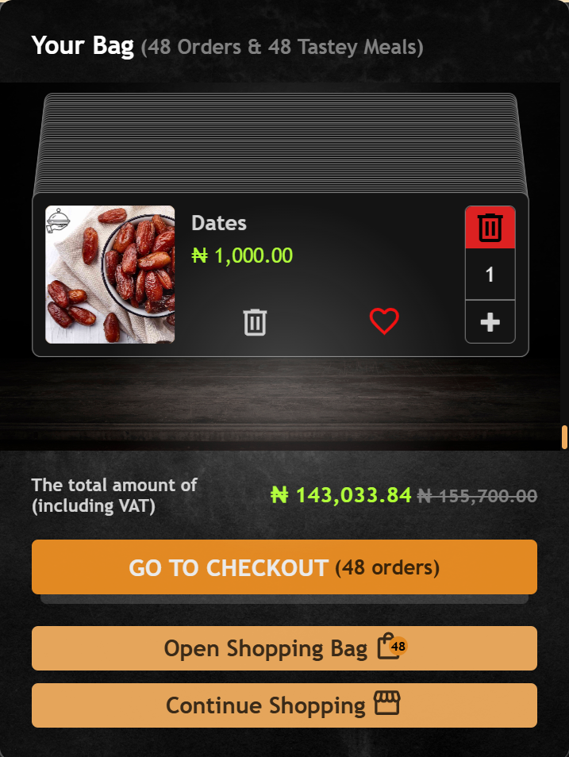
_Default view of the Tastey Mini Bag_

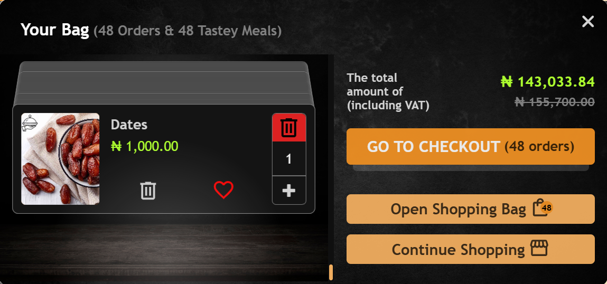
_Responsive view of the Tastey Mini Bag_

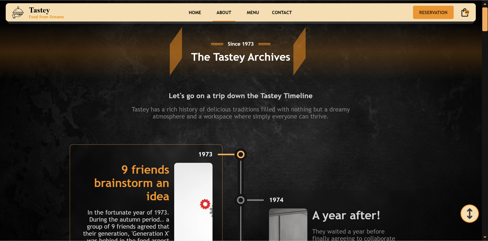
_Desktop view of the Tastey About Page_

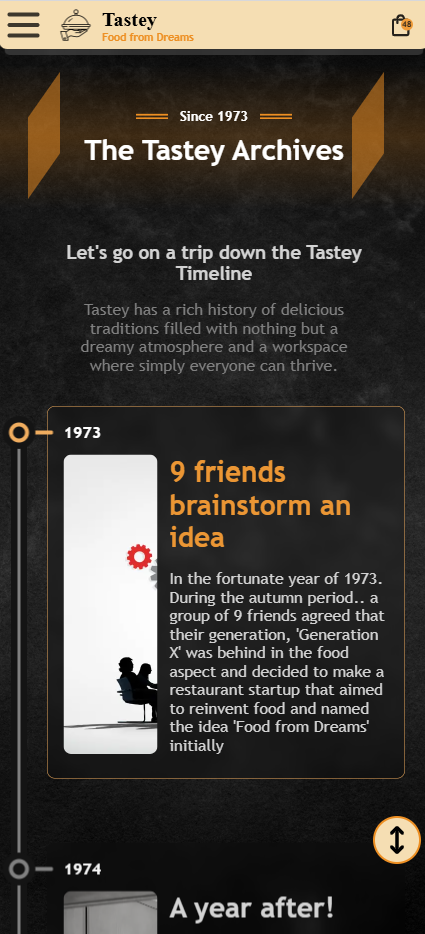
_Mobile view of the Tastey About Page_

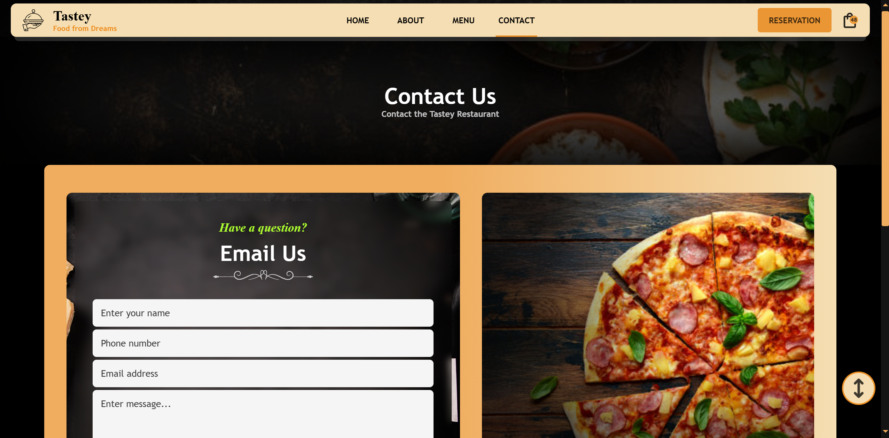
_Desktop view of the Tastey Contact Page_

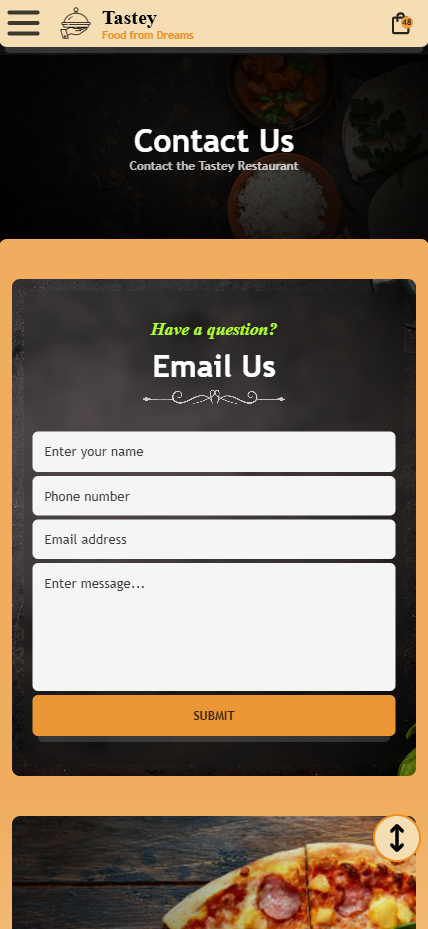
_Mobile view of the Tastey Contact Page_

### More Info!

#### Folder Contents

- assets
  - audio
  - subtitles
  - tastey-archive-images
  - tastey-desserts-images
  - tastey-dining-video
  - tastey-drinks-images
  - tastey-food-themed-backgrounds
  - tastey-main-meal-images
  - tastey-meal-icons
  - tastey-meal-images
  - Tastey-previews
  - Tastey-reviewers
  - tastey-starters-images
  - videos
- JSON
  - tastey_archives.json
  - tastey_meals.json
- scripts
  - about.js
  - build-scroller.js
  - CRUD.js
  - fetch-archives.js
  - fetch-meals.js
  - footer.js
  - index.js
  - menu.js
  - mini-bag.js
  - service-worker-helper.js
  - toast.js
  - audio.js
  - video.js
  - TasteyManager.js
  - utils.js
- styles
  - about.css
  - contact.css
  - index.css
  - menu.css
  - required.css
  - scroll-bar.css
  - tastey-audio.css
  - tastey-video.css
- about.html
- contact.html
- index.html
- menu.html
- README.md
- success.html
- reservation.html
- Tastey_service_worker.js

### Built with

- HTML5 markup
- CSS custom properties
- Flexbox
- Super Responsive Workflow
- Vanilla Javascript

### Links

To view the live preview of this webpage, you can visit _[here][1]_ or you can also visit _[here][2]_ to view the github repository that houses this project

[1]: https://tobi007-del.github.io/RESTAURANT_THEMED_SITE/index.html "LIVE PREVIEW OF THE TASTEY WEBSITE"
[2]: https://github.com/Tobi007-del/RESTAURANT_THEMED_SITE "GITHUB REPOSITORY FOR THIS PROJECT"
