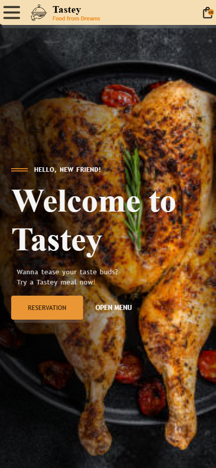

# A WEBSITE FOR A THE TASTEY RESTAURANT

### Table of contents

## Project Developer

- I am Oketade Oluwatobiloba, a Fullstack Developer in training. This restaurant themed website is a supposed website for a made up restaurant called 'Tastey'. It was supposed to be a school assignment but I ventured into it alone since the teacher was no longer interested. The goal for now is to finish the project.

## Brief Description

This project includes html files, css files in a style folder and js files in a scripts folder and the assets folder containing all the extra materials used in development for the web pages of a restaurant website for The Tastey Restaurant.
It is a 5 page website but connected to each other by internal links. 
It is a personal project and I would really like to describe it as just practice.

## Visusal Previews

*Mobile view of the Tastey Landing Page*

